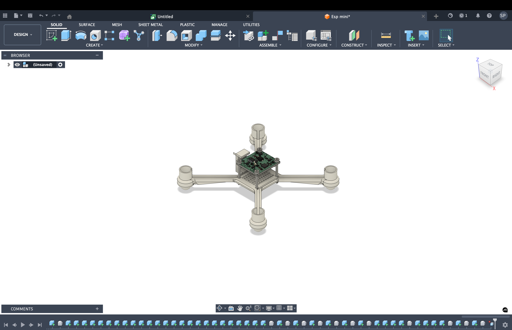
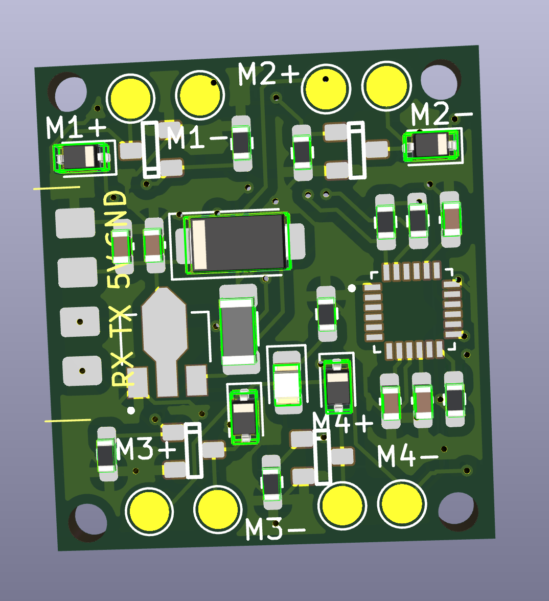
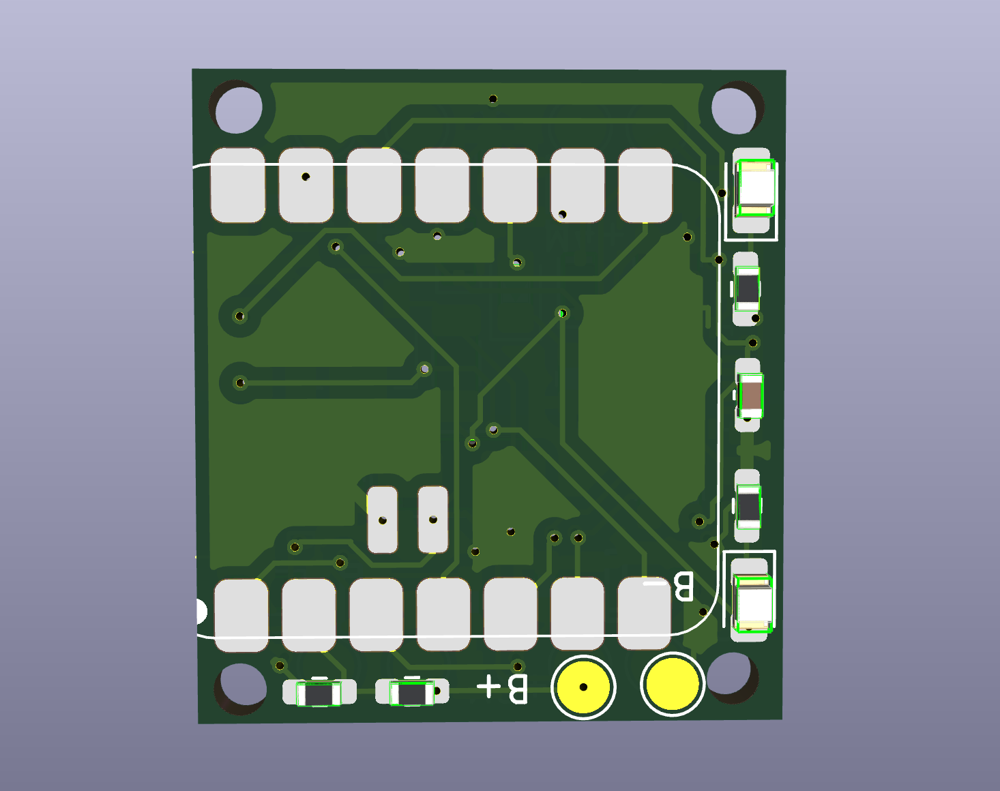

# esp_mini
A Esp  based flight controller which is really tiny and can be controller through almost everything from your phone to anthor esp and cn also be used as swarn drones likw the drones which do all those cool drone lighting show. Actually i made this drone with that idea only ive been seen those swarn drones show in my school and wated to do smtg like that but there not a single affordable platform for that but you can achevie the same results with this drone at a really affordable range.

##compnents 
- Xiao ESP32 S3 (FC)
- MPU 6050
- 8520 Coreless Motor 2xCW & 2xCCW
- 55mm Propeller 2xCW & 2xCCW
- Coustom motor drive:
    • SI2300 1N-MOSFET 4x
    • 1N4148 Diode 4x
    • 10k ohm Resistor 4X
## Frame

# Schematics
 Here is the break down of the connections 
  MOTORS-
  M1 --> A8
  M2 --> A3
  M3 --> A2
  M4 --> A0

  MPU6050-
  SDA --> A4
  SCL --> A5

  CRSF-
  RX --> D7
  TX --> D6

  3.7v to 5v-
  for reciver to get powered 

  led-
  2 power led
  1 arm led

  Battery Voltage Telemetry-
  Vin --> A1
  

# PCB 
The PCB is designed in Kicad 
top -

bottom -

# Firmware

This project uses open-source flight controller firmware from the ESP-FC project,
developed by rtlopez.

- Original firmware repository:
  https://github.com/rtlopez/esp-fc
